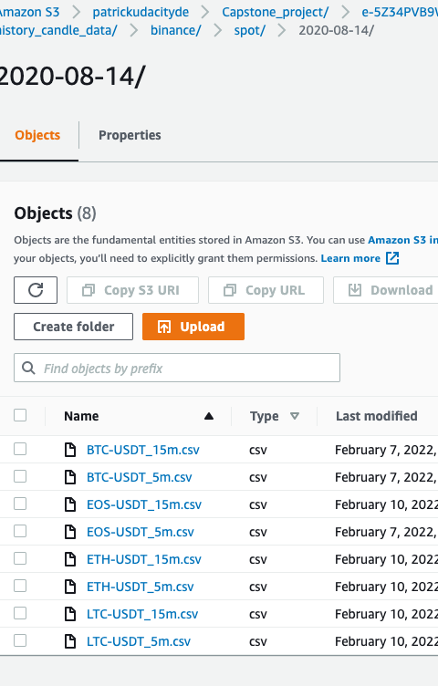

# Data Engineering Nanodegree - Udacity

### Overview

This Project is aimed to provide a Cloud Data Engineering solution for a Crypto Currency Hedge-Fund company.
* Data Source: The automated Data pipeline will fetch data from different sources:
    1. the trading data from the largest crypto currency exchange Binance for different trading pair per day/hour/minute; (will use fetch on daily basis for below dataflow and other demonstrations.)
    2. the weather data.
    3. the SPY price info from Yahoo Finance.
* Storage: The data will be processed by Pyspark and saved as Parquet format in S3 (or HDFS) for other team to use. ( eg. also trading team, quantative trader, ML engineer)
<!-- * The processed data will also be load into Relational DataBase ( Amazon Redshift) for SQL users (eg. data analyst, business analyst). -->
* Computing: For this specific use case, I will utilize Spark-hadoop/Spark-s3 echosystem for a high efficient distributed computing purpose, becasue the time is money for a Hedge-Fund; 
    No Relational-database will be incorporated, but this solution do have the ability to load data into Relational database in Amazon Echosystem. (Redshift)

#### Scope the Project and Gather Data

* The data will become source-of-truth datalake for quant/trading team to utilize for their model training/backtesting, or market/price forcasting.

* The DataFLow:
    1. the data will be first fetched and saved by different day from the Binance Exchange.
        
        
    2. the format_save.py will loop over each folder and concact the trading data of each trading pair for each day to a single csv file.
        
    3. the steps in ETL will process and save the data as Parquet format in S3.
    
* the use of airflow:
    In this project, airflow is utilized as a task orchestrition tool: the fetch and save should run on daily basis, and all downstream tasks will also need to run everyday.

#### Explore and Assess the Data

* Since the trading data is fetched from Crypto Currency Exchange through API, so there will be missing value when network bottleneck met. 
* Steps necessary to clean the data:
    * Drop the duplicate data before storage.
    
    

#### Define the Data Model

* Map out the conceptual data model and explain why you chose that model: 
Logical Data Model:

* List the steps necessary to pipeline the data into the chosen data model
    1. in the fetch and save process, we drop duplicate records.
    2. in the ETL process, we check missing value and duplicate.

#### ETL to Model the Data

* Create the data pipelines and the data model
* Include a data dictionary
* Run data quality checks to ensure the pipeline ran as expected 
  * the data should be unique on candle_begin_time.
  * any rows with missing value should be dropped.

#### Next Steps:

* The approach for the following scenarios:
  * If the data was increased by 100x.
      The S3 lake storage can handle the data volume, however we do need to increase the EMR cluster size. Since the Spark processes the data in Memeory, we'll need more nodes with higher memeory.
  * If the pipelines were run on a daily basis by 7am.
      Need set up the job schedule 7am on airflow.
  * If the database needed to be accessed by 100+ people.
      Create more EMR clusters for different users( all EMR cluster should be able to access the same S3 storage.) By isolating the users in different cluster, the accessibility of the data won't be an issue. 

